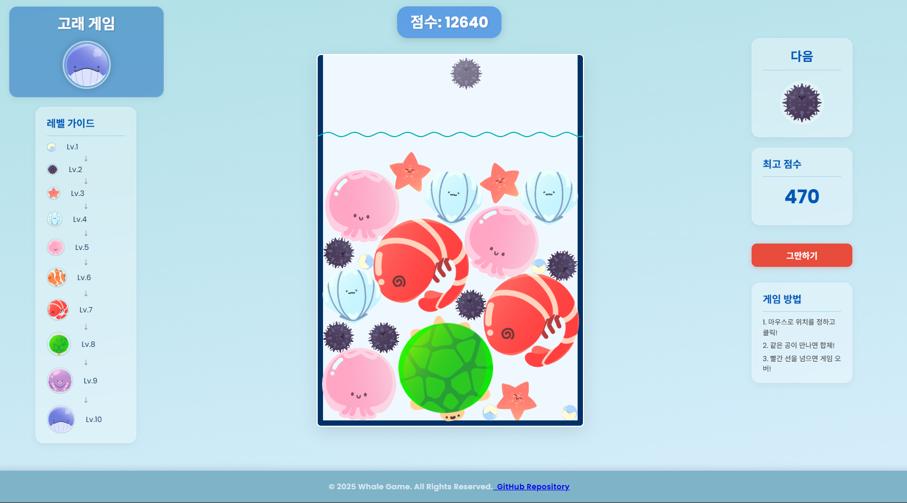

# 🐋 고래 게임 (Whale Game)

> 마우스로 해산물을 떨어뜨리며 합쳐가는 물리 기반 퍼즐 게임  
> **Matter.js** 로 구현된 귀여운 어항 속 생존 대결!

---

## 🎮 플레이하기

👉 [**고래 게임 실행하기**](https://ssongchaewon.github.io/gamePJ1/game/ball.html)

---

  
> 💡 *게임 메인 화면 예시 – 같은 해산물을 합쳐 더 큰 해산물을 만들어보세요!*

---

## 🧩 게임 설명

**플레이 방식**

- 🐚 마우스로 위치를 조정하고 클릭해 해산물을 떨어뜨리세요.  
- 🪸 같은 종류의 해산물끼리 부딪히면 더 큰 해산물로 **합체!**  
- 🎯 합체할수록 점수가 올라가며, 고래까지 키워보세요!  
- 💣 어항 속 해산물들이 **빨간 선을 넘으면 게임오버!**  
- 🧠 최고 점수는 **자동 저장(LocalStorage)** 으로 관리됩니다.

---

## 🧭 제작 과정

> 게임 기획부터 구현까지의 과정을 정리한 발표 자료입니다.  
> (UI 설계, 물리엔진 적용, 문제 해결 과정 포함)

🎞️ [**제작 과정 PPT 보기**](https://ssongchaewon.github.io/gamePJ1/game/ppt/) 
 [**초기 코드 실행하기**](https://ssongchaewon.github.io/gamePJ1/game/ppt/ball.html) 

---

## ⚙️ 기술 스택

- **JavaScript (ES6+)**
- **Matter.js (Physics Engine)**
- **HTML5 Canvas**
- **CSS3 (Flex / Animation)**
